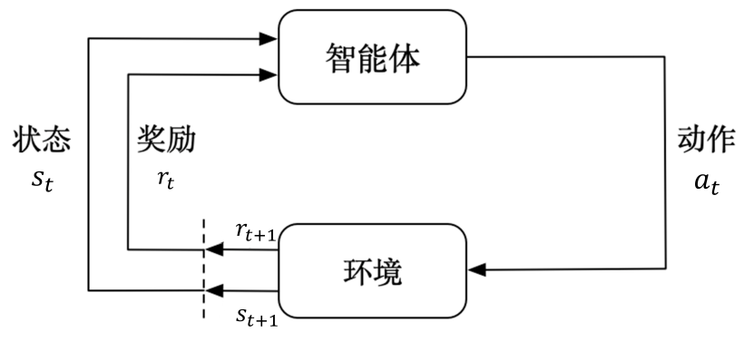
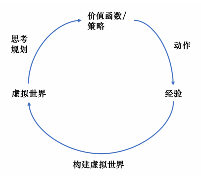

# RL
## 我眼中的RL
Agent 通过observe environment，根据现在的state 进行decision，然后选择了一个action 从而获得到 reward的过程

## RL的小知识点
1. RL的输入样本是**序列数据**，这么看来，RL是面向过程的学习。
2. Agent获得能力的过程是一个探索和利用 **（exploration and exploitation）** 的过程。
3. RL 没有supervisor 一般是一个延迟的reward 来进行的。

# DRL
DRL = RL + DL
## 标准强化学习
需要先设计特征（需要人为定义或者选择特征），再通过设计分类网络或者价值估计函数来采取动作
## 深度强化学习
不需要设计特征，输入state 就可以得到action。可以通过一个神经网络来你和价值函数或策略网络

# 序列决策
reward是一个由state给予的反馈信号，RL 的目的是使Agent 获得的总reward 最大

历史是一个包含观测、动作、奖励的序列
$H_t = [o_1, a_1, r_1, \ldots, o_t, a_t, r_t]$

整个RL的任务的state 相当于一个关于History的函数
$s_t = f(H_t)$

state 是完整的世界信息，observation是对state的部分描述

RL是一个马尔可夫决策过程（MDP）如果Agent只能观测到当前状态或者说是上一帧的信息，那么称之为部分可观测马尔可夫决策过程（POMDP）

部分可观测马尔可夫决策过程可以用一个**七元组**描述： \(S, A, T, R, Ω, O, γ\) 。其中 \(S\) 表示状态空间，为隐变量，\(A\) 为动作空间，

\(T(s′|s, a)\) 为状态转移概率，\(R\) 为奖励函数，\(Ω(o|s, a)\)为观测概率，\(O\) 为观测空间，\(γ\)为折扣因子。

# 动作空间
下象棋这种是**离散动作空间**，动作一步一步执行，动作数量有限。机器人的行为一般是**连续动作空间**，动作数量无限。
# RL的Agent的组成成分和类型
## 策略
**策略（policy）**：Agent 会根据policy来选择下一个action。
策略分为随机性策略和确定性策略：
1. 随机性策略：
$\pi(a|s) = p(a_t = a|s_t = s)$
,即输入一个状态s，输出一个概率分布，对这个概率分布采样可以得到Agent 将会采取的Action
2. 确定性策略：Agent直接选取概率最大的action

一般用随机性策略，可以更好的探索环境，使动作具有多样性
## 价值函数
**价值函数**：用于评估Agent 进入某步state 可以对后面的reward 带来多大的影响。
价值函数的值是对未来奖励的预测，用它来评估状态的好坏。定义一个折扣因子，使距离当前时间步越远的奖励对下一步的action决策影响越小。
价值函数可以定义为：

$$
V_\pi(s) \doteq \mathbb{E}_\pi \left[ G_t \mid s_t = s \right] = \mathbb{E}_\pi \left[ \sum_{k=0}^\infty \gamma^k r_{t+k+1} \mid s_t = s \right], \quad \forall s \in S
$$

另外一种价值函数：Q函数：包含了两个变量action和state，其定义为：
$$Q_\pi(s，a) \doteq \mathbb{E}_\pi[G_t \mid s_t = s, a_t = a] = \mathbb{E}_\pi\left[\sum_{k=0}^\infty \gamma^k r_{t+k+1} \mid s_t = s,a_t = a \right], \text{对于所有的 } s \in S$$

其意义为：未来可以获得reward 的期望取决于当前的state 与action

## 模型
**模型**：表示Agent 对环境的state 的理解，下一步的state 取决于当前的state 以及当前 采取的action
一般由状态转移概率和奖励函数两个部分组成
1. 状态转移函数： $p_{ss'}^a = p(s_{t+1} = s' \mid s_t = s, a_t = a)$
2. 奖励函数：\(R(s, a) = \mathbb{E}[r_{t+1} \mid s_t = s, a_t = a]\)

有了策略、价值函数和模型三个组成部分之后，就形成了一个马尔可夫决策过程（MDP）

1. 基于策略的RL
eg：在学习好某个环境之后，每一次选择都是最佳动作
2. 基于价值的RL
eg：利用价值函数作为导向，每一个状态会返回一个价值，比如说每走一步会-1分，那么离终点最近的状态的价值是-1，其次的是-2，以此类推，
Agent会选择下一个可以使状态的价值上升的action 进行执行。
## 强化学习Agent的类型
### 根据学习的事物不同进行的划分
1. 基于价值的Agent（value-based agent）：显式的学习价值函数，隐式的学习策略，策略是从学到的价值函数中推算出来的。
2. 基于策略的Agent（policy-based agent）：给定一个state，就会输出对应action 的概率。
3. 演员-评论员Agent（actor-critic agent）：策略与价值函数都学习，通过两者的交互得到最佳动作。
### 根据有无学习环境模型进行划分
1. 有模型（model-based）：Agent 通过学习状态的转移来采取动作（比免模型的RL多了一个对真实环境进行建模的过程）

2. 免模型（model-free）：Agent没有去直接估计状态的转移，也没有得到环境的具体转移变量，通过学习价值函数和策略函数进行决策。

实际应用中Agent并不能完全知道MDP中的所有元素，此时就需要利用免模型的强化学习，通过利用reward与状态迁移给予的反馈信息来更新动作策略，这样反复迭代，直到学习到最优策略。

# 探索与利用
RL中 **探索（exploration）** 和 **利用（exploitation）** 是核心

exploration 市区探索环境，通过尝试不同的action 来获得最佳的策略

exploitation

