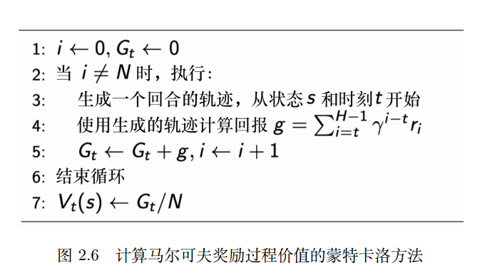
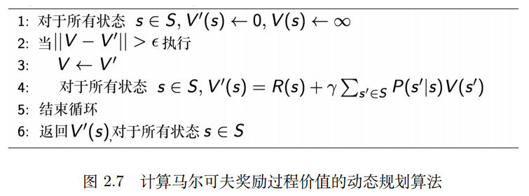
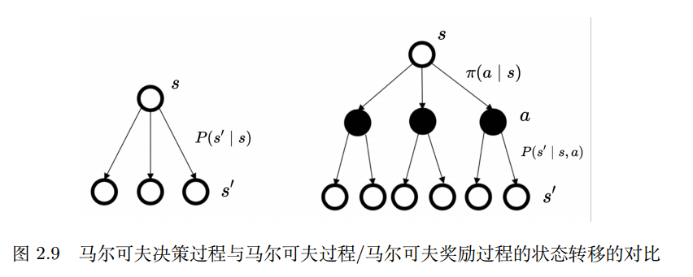
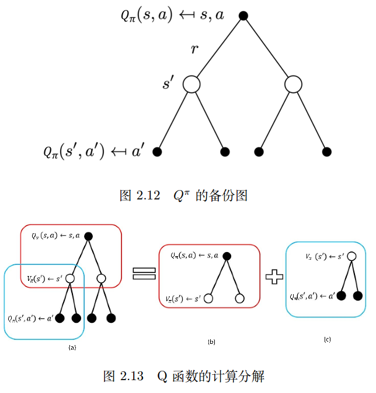
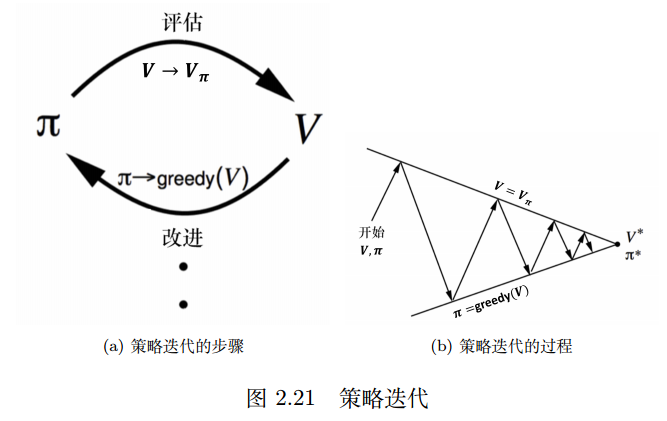

# 马尔可夫决策过程
## 马尔可夫过程（MP）
**马尔可夫性质**：指一个随机过程在给定现在的状态以及过去的所有状态的情况下，其未来状态的概率分布仅依赖于当前状态。

$$
p(X_{t+1} = x_{t+1} \mid X_{0:t} = x_{0:t}) = p(X_{t+1} = x_{t+1} \mid X_t = x_t) \tag{2.1}
$$

前面那个概率公式包含了0到上一时间步t的所有，等价于只有上一时间步t

设历史状态为 $h_t = {s_1,s_2,...,s_t}$ ,马尔可夫过程满足下列条件

$$
p(s_{t+1} \mid s_t) = p(s_{t+1} \mid h_t)
$$

**马尔可夫链**：有点像有向图，节点表示状态s_N，边表示转移概率。可以用**状态转移矩阵**$P$来表示

## 马尔可夫奖励过程（MRP）
大部分与马尔可夫链一样，但是多了奖励函数，R是一个期望，表示当达到某一个状态的时候可以获得多大的奖励，增加一个折扣因子来对预估未来的回报进行，折扣因子的作用是距离当前状态越远（未来的某一个状态）的预估奖励对当前状态的影响越小（避免奖励无穷无尽）

**折扣回报**：
$$
G_t = r_{t+1} + \gamma r_{t+2} + \gamma^2 r_{t+3} + \gamma^3 r_{t+4} + \dots + \gamma^{T-t-1} r_T
$$

**状态价值函数**：字面意思，该状态的价值
$$
V^t(s) = \mathbb{E} \left[ G_t \mid s_t = s \right] \\
       = \mathbb{E} \left[ r_{t+1} + \gamma r_{t+2} + \gamma^2 r_{t+3} + \dots + \gamma^{T-t-1} r_T \mid s_t = s \right]
$$

## 贝尔曼方程
贝尔曼方程定义了状态之间的迭代关系
从价值函数冲推导出贝尔曼方程：
$$
V(s) = \underbrace{R(s)}_{\text{即时奖励}} + \gamma \underbrace{\sum_{s' \in S} p(s' \mid s) V(s')}_{\text{未来奖励的折扣总和}}
$$

当前状态的奖励 = 即时奖励 + 未来奖励的折扣总和。

未来奖励的的折扣总和：是对转移到未来某一个状态s'的概率与s'的状态价值的乘积的求和(未来所有可能发生的状态的和)

### 全期望公式与贝尔曼方程的推导
（书的第25 页，公式推导，感觉过一遍就行，学过概率论和线代的应该都看得懂）
### 计算马尔可夫奖励过程价值的迭代算法
eg:动态规划，蒙特卡洛，时序差分学习（前两者的结合）

1. 蒙特卡洛方法

比如说从某一个状态开始，执行了1000次实验，得到1000个轨迹，与这1000个轨迹的汇报。求平均值等价于现在这个状态的价值。这个价值即定义了未来可能获得多少的奖励

2. 动态规划方法

不断利用迭代贝尔曼方程将状态价值函数进行更新，直到价值函数收敛，最新的状态价值，即可作为当前状态的价值。

## 马尔可夫决策过程
比马尔可夫奖励过程要多考虑一个因素是当前的动作（action）
满足条件：

$$
p(s_{t+1} \mid s_t, a_t) = p(s_{t+1} \mid h_t, a_t)
$$

奖励函数R：

$$
R(s_t = s, a_t = a) = \mathbb{E}[r_t \mid s_t = s, a_t = a]
$$

### MDP中的策略
策略：在某一个状态应该采取什么样的动作，将当前状态输入到策略中会返回一个关于所有可能采取动作的概率，也可能是直接输出一个动作

$$
\pi(a \mid s) = p(a_t = a \mid s_t = s)
$$

如果策略是已知的，那么MDP可以变为MRP
状态转移概率为：

$$
P_\pi(s' \mid s) = \sum_{a \in A} \pi(a \mid s) p(s' \mid s, a)
$$

奖励函数为：

$$
r_\pi(s) = \sum_{a \in A} \pi(a \mid s) R(s, a)
$$

MDP与MRP/MP的区别在于，MDP会在当前状态的时候优先根据策略决策动作，根据当前动作生成下一个时间段的状态分布概率。即在状态转移过程中，两个状态之间由某一个动作进行衔接。

### MDP中的价值函数
**价值函数（V函数）**：

$$
V_\pi(s) = \mathbb{E}_\pi \left[ G_t \mid s_t = s \right]
$$

**动作价值函数（Q函数）**：（贝尔曼方程的推导在P30）

$$
Q_\pi(s, a) = \mathbb{E}_\pi \left[ G_t \mid s_t = s, a_t = a \right]
$$

### 贝尔曼期望方程
V函数和Q函数的两种形式
V函数的期望方程：

$$
V_\pi(s) = \mathbb{E}_\pi \left[ r_{t+1} + \gamma V_\pi(s_{t+1}) \mid s_t = s \right]
$$

$$
V_\pi(s) = \sum_{a \in A} \pi(a \mid s) \left( R(s, a) + \gamma \sum_{s' \in S} p(s' \mid s, a) V_\pi(s') \right)
$$

Q函数的期望方程：

$$
Q_\pi(s, a) = \mathbb{E}_\pi \left[ r_{t+1} + \gamma Q_\pi(s_{t+1}, a_{t+1}) \mid s_t = s, a_t = a \right]
$$

$$
Q_\pi(s, a) = R(s, a) + \gamma \sum_{s' \in S} p(s' \mid s, a) \sum_{a' \in A} \pi(a' \mid s') Q_\pi(s', a')
$$

### 备份图
备份图定义了未来下一时刻的状态价值函数与上一时刻的状态价值函数之间的关联。

### 策略评估
已知策略，计算价值函数 $V_π(s)$ 的过程就是策略评估
### 预测和控制
- 预测：输入一个MDP和策略π，输出的是价值函数$V_π$，目的是评估一个给定策略
- 控制：输入一个MDP，输出的是最佳价值函数和最佳策略，目的是搜索最佳策略

### 动态规划
**动态规划**适合解决满足**最优子结构**和**重叠子问题**的两个性质的问题

- 最优子结构：问题可以拆分成一个个小问题，通过解决小问题的答案即可得到原问题的答案。

- 重叠子问题：子问题出现多次，并且子问题的解决方案可以被重复使用，可以保存首次的计算结果，在之后需要时直接使用。

### MDP中的策略评估
把**贝尔曼期望备份**变成迭代的过程，反复迭代直到收敛。 这个迭代过程可以看作**同步备份**的过程

大概就是把下面的这个贝尔曼期望备份反复迭代，直至不再更新。

$$
V^\pi(s) = \sum_{a \in A} \pi(a \mid s) \left[ R(s, a) + \gamma \sum_{s' \in S} p(s' \mid s, a) V^\pi(s') \right]
$$

下面这个网页（斯坦福的）动态显示了一个示例的评估过程：
https://cs.stanford.edu/people/karpathy/reinforcejs/gridworld_dp.html

### MDP过程控制
策略评估是给定MDP和策略，从而估算出价值函数的值。如果只有MDP，找**最佳策略**并且得到**最佳价值函数**的过程就是过程控制。

最佳策略使得每个状态的价值函数都取得最大值

策略搜索的方法
1. 穷举：没有效率
2. 策略迭代
3. 价值迭代

### 策略迭代
分为两个步骤：策略评估和策略改进

策略评估就是给当前的策略函数估计状态价值函数。

策略改进是利用状态价值函数推算Q函数，对Q函数最大化，然后做贪心搜索来进一步改进策略。

二者反复迭代进行

### 贝尔曼最优方程
$$
V_\pi(s) = \max_{a \in A} Q_\pi(s, a)
$$

贝尔曼最优方程表明：最佳策略下的一个状态的价值必须等于在这个状态下采取最好动作得到的回报的期望
### 价值迭代（感觉没啥东西，就是一个迭代算法，P41）
#### 最优性原理
最优性原理定理：一个策略$π(a|s)$在状态$s$达到了最优价值，即$V_\π(s) = V^*(s)$，当且仅当对于任何能够从$s$到达的状态$s'$，都已经达到了最优价值，即对于所有的$s'$，都有$V_\π(s') = V^*(s')$恒成立。
#### 确认性价值迭代
#### 价值迭代算法

### 策略迭代与价值迭代的区别
- 策略迭代：两步：一步策略评估，一步是策略改进。迭代进行这两步直到策略收敛。
- 价值迭代：直接使用贝尔曼最优方程进行迭代，从而寻找最佳的价值函数。找到最佳的价值函数后再提取最佳策略

