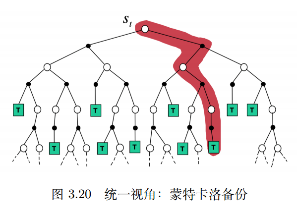
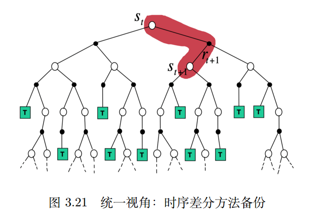

# 表格型方法

策略最简单的表示方式是查找表。eg：蒙特卡洛，Q学习，Sarsa。

## MDP

### Model_based

知道环境的状态转移概率和奖励函数，就可以认为这个环境是已知的。如果环境已知，可以用动态规划算法去计算，任务成功的概率最大的最佳策略是什么。

### Model_free

环境未知，利用V函数来表示状态的好坏，利用Q函数来判断在什么状态下采取什么动作能够取得最大的奖励。

### 有无模型的区别

如图：

有模型的RL是不需Agent与环境进行交互，免模型的RL，需要Agent与环境进行交互，采集大量的轨迹数据从轨迹中获得信息，改进策略，从而获得更多的奖励（感觉本质是试错）

## Q表格

Q表格就是横纵轴是动作与状态的一个表格，表格中的数值代表了再该状态下采取某动作的的价值

表格中的价值往往是用未来的总奖励来评价当前动作的好坏

原因：现实世界中奖励往往是延迟的，所以强化学习需要学习远期的奖励。一般会从当前状态开始，把后续有可能会收到的所有奖励加起来计算当前动作的Q值，让Q值可以真正代表当前状态下动作的真正价值。

如果是一个持续性任务（没有尽头的任务）那么将非常遥远的未来的奖励看的太重并不好，所以需要增加一个折扣因子$γ$越远的奖励对当前价值的影响越小。

强化是指我们可以用下一个状态的价值来更新当前状态的价值，化是指我们可以用下一个状态的价值来更新当前状态的价值，

## 免模型预测

环境不能完全已知。利用蒙特卡洛方法或者时序差分法来估计某个给定策略的价值。

### 蒙特卡洛策略评估

**蒙特卡洛**方法是基于采样的方法，给定策略$π$，可以让智能体与环境进行交互，可以得到很多轨迹。，每个轨迹都有对应的回报：$G_t = r_{t+1} + \gamma r_{t+2} + \gamma^2 r_{t+3} + \cdots$

我们求出所有轨迹回报的平均值，就可以知道某一个策略对应状态的价值（V函数）

蒙特卡洛仿真是指我们可以采样大量的轨迹，计算所有归集的真实回报，然后计算平均值。蒙特卡洛方法使用经验平均回报的方法来估计。不需要MDP的状态转移函数和奖励函数，并且不需要像动态规划那样用自举的方法。

局限性：只能用在有终止的MDP中

下图（公式太多了，看书p52，下面是手稿的小总结）

动态规划方法使用了自举（基于之前估计的量来估计一个量）的方法，同时还是用了贝尔曼期望备份，用上一时刻的$V_{i-1}(s')$来更新当前时刻的值$V_i(s)$
即：

$$
V_i(s) \leftarrow \sum_{a \in A} \pi(a \mid s) \left( R(s, a) + \gamma \sum_{s' \in S} P(s' \mid s, a)V_{i-1}(s') \right)
$$

将其不停迭代，最后可以收敛

1. 蒙特卡洛方法适用于环境未知的情况，而动态规划是有模型的方法。
2. 蒙特卡洛方法只需要更新一条轨迹的状态，而动态规划方法需要更新所有的状态

### 时序差分

关键点：下一个状态的价值可以不断地强化影响上一个状态的价值

时序差分方法的目的：对于给定的策略$π$，在线（online）地算出它的价值函数$V_π$，即一步一步的算。

最简单的算法是一步时序差分$TD（0）$。每往前走一步，就作一步自举，用得到的估计回报$r_{t+1} + γV (s_{t+1})$ 来更新上一时刻的值$V (s_t)$：

$$
V (s_t) ← V (s_t) + α (r_{t+1} + γV (s_{t+1}) − V (s_t))
$$
估计回报$rt+1 +γV (st+1)$被称为时序差分目标（TD target）,时序差分目标是带衰减的未来奖励的总和。

时序差分目标由两部分组成：
- 走一步后得到的实际奖励$r_{t+1}$。
- 通过之前的估计来估计$V (s_{t+1})$,并且增加了折扣因子$γV (s_{t+1})$
时序差分目标是估计有两个原因：
- 时序差分方法对期望值进行采样；
- 时序差分方法使用当前估计的$V$而不是真实的$V_π$。

时序差分误差:$δ = r_{t+1} + γV (s_{t+1}) − V (s_t)。$

更新$ V (s_t)$来逼近真实回报$G_t$，具体更新公式为：
$$
V(s_t) \leftarrow V(s_t) + \alpha \left( G_{i,t} - V(s_t) \right)
$$

1. 时序差分方法可以在线学习（online learning），每走一步就可以更新，效率高。蒙特卡洛方法必须等游戏结束时才可以学习。

2. 时序差分方法可以从不完整序列上进行学习。蒙特卡洛方法只能从完整的序列上进行学习。
3. 时序差分方法可以在连续的环境下（没有终止）进行学习。蒙特卡洛方法只能在有终止的情况下学习。
4. 时序差分方法利用了马尔可夫性质，在马尔可夫环境下有更高的学习效率。蒙特卡洛方法没有假设环境具有马尔可夫性质，利用采样的价值来估计某个状态的价值，在不是马尔可夫的环境下更加有效。

一步时序差分拓展n步时序差分，即往前走n步，利用n步的回报来更新状态的价值。

如果$n = ∞$即整个游戏结束后，再进行更新，时序差分方法也就变成了蒙特卡洛的方法
### 动态规划方法、蒙特卡洛方法以及时序差分方法的自举和采样
**自举**：是指更新时使用了估计。
**采样**：是指更新时通过采样得到一个期望。
#### 动态规划

#### 蒙特卡洛

#### 时序差分

## 免模型控制
广义策略迭代：把策略迭代进行广义的推广，使它能够兼容蒙特卡洛和时序差分的方法，即带有蒙特卡洛方法和时序差分方法的广义策略迭代。

策略迭代由两个步骤组成：
1. 给定当前的策略来估计价值函数。
2. 得到估计的价值函数后，通过贪心的方法来改进策略。

这两个步骤相互迭代

基于探索性开始的蒙特卡洛方法：

基于 ε-贪心探索的蒙特卡洛方法

与蒙特卡洛方法相比，时序差分方法有如下几个优势：低方差，能够在线学习，能够从不完整的序列中学习。所以我们可以把时序差分方法也放到控制循环（control loop）里面去估计 Q 表格，再采取 ε-贪心探索改进。这样就可以在回合没结束的时候更新已经采集到的状态价值。

偏差（bias）：描述的是预测值（估计值）的期望与真实值之间的差距。偏差越高，越偏离真实数据。方差（variance）：描述的是预测值的变化范围、离散程度，也就是离其期望值的距离。方差越高，数据的分布越分散，如图 3.27 右列所示。

